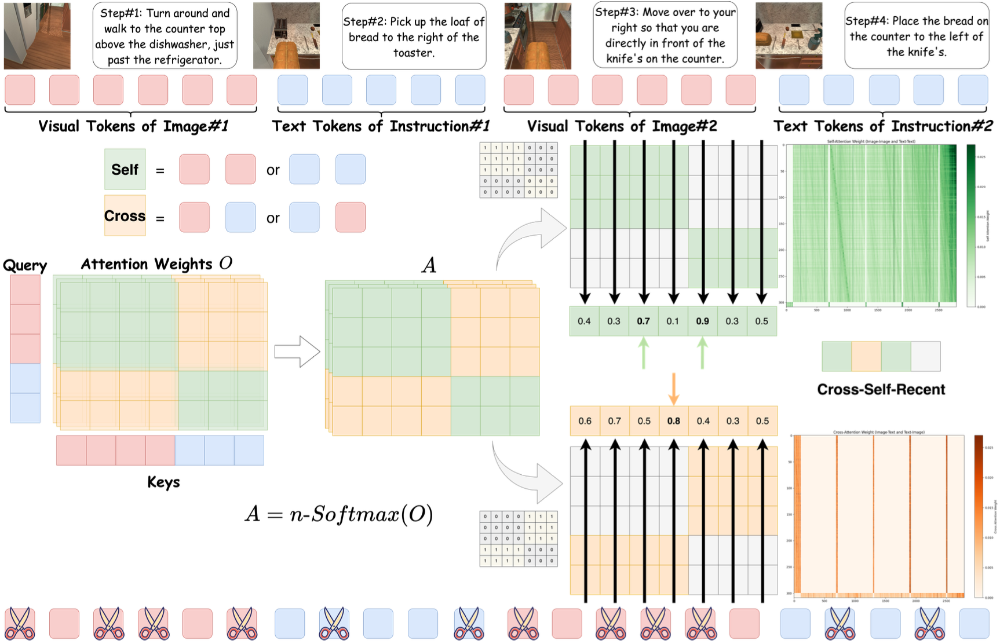

<div align="center">
 <br>
</div>

<h2 align="center"><a href="https://arxiv.org/abs/2412.04652">⚖️ Cross-Self KV Cache Pruning for Efficient Vision-Language Inference</a></h2>

[Xiaohuan Pei](https://github.com/TerryPei/CSP)<sup>1</sup>,Tao Huang<sup>1</sup>,Chang Xu<sup>1</sup>

<sup>1</sup>  University of Sydney

<h5 align="center"> If you find our project helpful, please give us a star ⭐ on GitHub to stay updated.</h5>


<h5 align=center>

[](https://github.com/huggingface/transformers)
[](https://arxiv.org/abs/2406.18139)
[](https://github.com/TerryPei/CSP/blob/main/LICENSE)
</h5>

## Overview

<div style="text-align: center;">
    
</div>

We propose decomposing attention scores into intra-modality attention (within the same modality) and inter-modality attention (across modalities), enabling more precise KV cache pruning by independently managing these distinct attention types. Additionally, we introduce an n-softmax function to counteract distribution shifts caused by pruning, preserving the original smoothness of attention scores and ensuring stable performance. Our final training-free method, **C**ross-**S**elf **P**runing (CSP), achieves competitive performance compared to models with full KV caches while significantly outperforming previous pruning methods. Extensive evaluations on MileBench, a benchmark encompassing 29 multimodal datasets, demonstrate CSP's effectiveness, achieving up to a 41\% performance improvement on challenging tasks like conversational embodied dialogue while reducing the KV cache budget by 13.6\%. 

## Usage

### Environment Setup
The Environments Setup is consistent with Milebench and LOOK-M
```
conda create -n CSP
pip install -r requirements.txt
```

### Test CSP and other methods:
```
conda activate CSP
bash ./scripts/new_eval.sh
```
### Demonstrate score
For clearly view the results, you can run
```
python eval_score.py
```
The generated eval_score.md will demonstrate the scores for each dataset.


*We employed LLaVA-v1.5-7b on RTX-4090 GPUs with flash-attn-2.4.3post1 and LLaVA-v1.5-13b on A100 GPUs with flash-attn-2.6.3 to conduct our experiments.*


## Acknowledgment
Our code structure is based on MileBench [[code]](https://github.com/MileBench/MileBench) and LOOK-M [[code]](https://github.com/SUSTechBruce/LOOK-M). Deeply thanks for their excellent works.

## Citation

#### If this paper helps your research, we would appreciate your citation: 


```bibtex
@article{pei2024cross,
  title={Cross-Self KV Cache Pruning for Efficient Vision-Language Inference},
  author={Pei, Xiaohuan and Huang, Tao and Xu, Chang},
  journal={arXiv preprint arXiv:2412.04652},
  year={2024}
}
```
